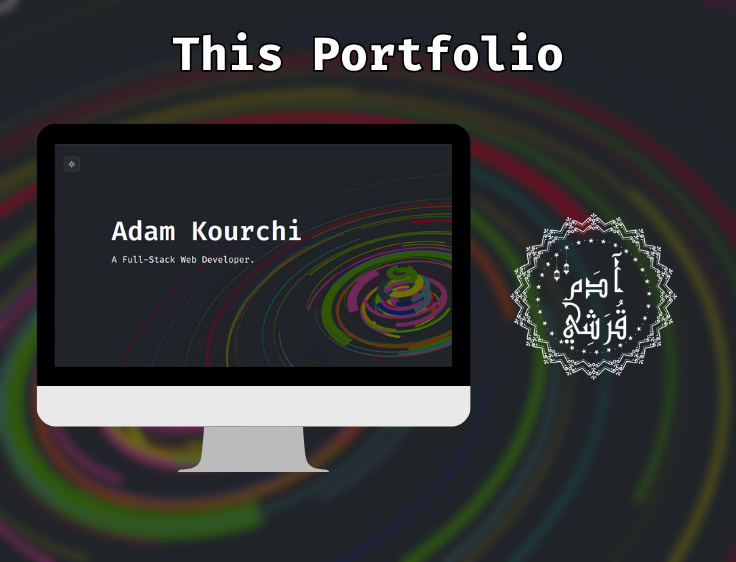
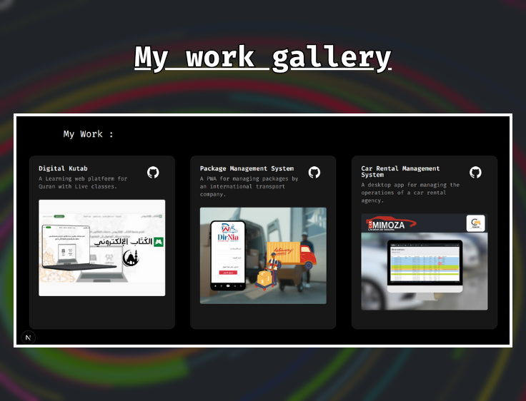

# 🌐 Personal Portfolio Website

**Description:**  
A modern and elegant portfolio website showcasing my projects, skills, and professional journey.

Built with **Next.js**, **React**, **Tailwind CSS**, and **shadcn/ui**, this portfolio reflects my focus on clean design, smooth user experience, and technical precision.  
It includes project highlights, dynamic light/dark theming, and a concise about section that introduces who I am and what I build.

Deployed on **Vercel** for instant updates and globally distributed performance.

---

## 🖼️ Preview

|  |  |
|--------------------------------------------|------------------------------------------|
|    |                                          |

---

## ✨ Key Features

- 🎨 Minimal, elegant design with fluid transitions  
- 🌗 Light and dark mode toggle  
- 🧩 Interactive project gallery with detailed previews  
- ⚡ Blazing-fast load times with Next.js static optimization  
- 📱 Fully responsive layout for all screen sizes  
- 🔄 Continuous deployment via Vercel  

---

## 🧠 Technologies Used

| Technology | Purpose |
|-------------|----------|
| ⚫ **Next.js** | Framework for React with hybrid rendering and routing |
| ⚛️ **React** | UI library for building dynamic interfaces |
| 💨 **Tailwind CSS** | Utility-first CSS framework for styling |
| 🧱 **shadcn/ui** | Modern component library for design consistency |

---

## 🚀 Deployment

- Hosted on **Vercel** with automatic CI/CD  
- Global CDN for optimal performance  

---

## 🏁 Live Demo

🌍 [Visit My Portfolio Website](https://adamkourchi.vercel.app/)
